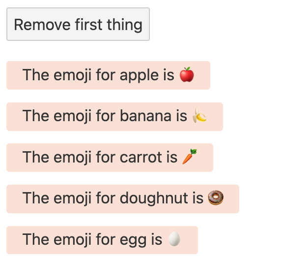
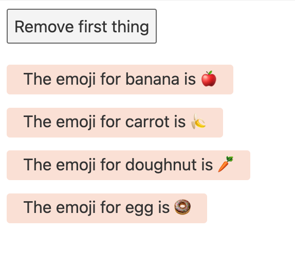

# 04. 조건문


## if 블럭

특정 마크업을 조건에 따라 노출하고 싶다면 if 블럭을 사용하세요.
`{#if `*`condition`*`}`<br>
`{:else if `*`anotherContion`*`}`<br>
`{:else}`

```html
{#if x>10}
<span>{x} 는 10보다 큽니다.</span>
{:else if x > 5}
<span>{x} is 5와 10 사이에요.</span>
{:else}
<span>{x} is 5보다 작아요.</span>
{/if}
```

## each 블럭

데이터 리스트를 나열해야할 때 each블럭을 사용하면 됩니다.
이 때, 나열되는 리스트는 array같은 length를 가진 iterable한 객체여야 해요.

추가적으로 index를 두번째 인자로 사용할 수도 있어요!

`{#each `*`iterable`* ` as `*` elem`*`, `*`index`*`}`

```html
{#each cats as cat, i}
<span>{i+1}번째 고양이: {cat.name}</span>
{/each}
```

### key가 있는 each 블력
each 블럭은 디폴트로 리스트의 가장 뒤쪽에 추가/삭제를 수행합니다. 즉, 우리가 아무리 중간에 뭘 빼고 뭘 집어넣어도 늘 마지막 원소만 없어지고 생긴다는 것이죠! 



```html
<script>
  import Thing from './Thing.svelte';

  let things = [
    { id: 1, name: 'apple' },
    { id: 2, name: 'banana' },
    { id: 3, name: 'carrot' },
    { id: 4, name: 'doughnut' },
    { id: 5, name: 'egg' },
  ];

  function handleClick() {
    things = things.slice(1);
  }
</script>

<button on:click={handleClick}>
  Remove first thing
</button>

{#each things as thing}
  <Thing name={thing.name}/>
{/each}
```


```html
<script>
  const emojis = {
        apple: "🍎",
        banana: "🍌",
        carrot: "🥕",
        doughnut: "🍩",
        egg: "🥚"
  }

  export let name;
  const emoji = emojis[name];
</script>

<p>
  <span>The emoji for { name } is { emoji }</span>
</p>

<style>
  p {
    margin: 0.8em 0;
  }
  span {
    display: inline-block;
    padding: 0.2em 1em 0.3em;
    text-align: center;
    border-radius: 0.2em;
    background-color: #FFDFD3;
  }
</style>

```



위 코드를 실행했을 때, 아래와 같은 화면이 보일거에요.
<figure>

</figure>

_**Remove first thing**_ 버튼을 클릭하면, 우리는 당!연!히! 리스트 맨 첫 요소가 삭제될 것이라고 생각하죠. 그치만, 짜잔-

<figure>

</figure>

*App*의 *thing[0]* 는 삭제되었지만, *Thing*에서 매핑된 *emoji*는 업데이트 되지 않은 것 같아요. *Thing* 컴포넌트가 처음 생성될 때, *emoji*가 생성된 후 *App*에서 넘겨준 *name*이 업데이트 되어도, 영향을 받지 않았기 때문입니다.

이걸 해결하기 위해, each 블락에 key를 추가할 수 있어요.

`{#each `*`iterable`* ` as `*` elem`*` (`*`key`*`)}`

key는 Svelte에게 어떤 원소가 추가되고 삭제되었는지 힌트를 줍니다. Svelte는 key와 원소를 Map으로 매핑해두었기 때문에, key는 string, number, object가 모두 가능합니다. 그치만 비교에 더 쉬운 string이나 number로 key를 설정하는게 훨씬 안정적입니다. 

```html
{#each things as thing (thing.id)}
  <Thing name={thing.name}/>
{/each}
```

> 사실 요것도 *emoji*를 업데이트합니다..<br>
> 성능 상 뭐가 더 좋을까요...? 🧐
> ```javascript
> $: emoji = emojis[name];
> ```

## Await 블럭

프로그래밍 하다보면, 비동기 작업을 해야할 때도 많죠. Svelte는 promise의 결과를 마크업에서 직접 사용할 수 있도록 합니다. 

`{await `*`promise`*`}`<br>
`{:then `*`value`*`}`<br>
`{/await}`

너무 편하다...!
그리고 항상 promise의 최신값을 가져오기 때문에, race같은건 고려하지 않아도 된다구 합니닷..

```html
<script>
  async function getRandomNumber() {
    const res = await fetch(`/tutorial/random-number`);
    const text = await res.text();

    if (res.ok) {
      return text;
    } else {
      throw new Error(text);
    }
  }

  let promise = getRandomNumber();

  function handleClick() {
    promise = getRandomNumber();
  }
</script>

{#await promise}
<p>...waiting</p>
{:then number}
<p>{number}</p>
{/await}

<!-- waiting 화면이 필요 없다면 -->
{#await promise then number}
<p>{number}</p>
{/await}
```
