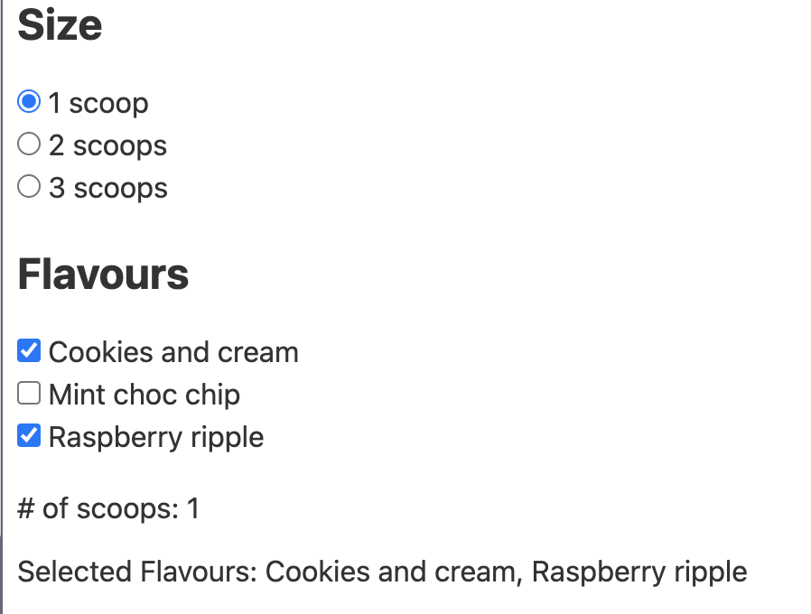
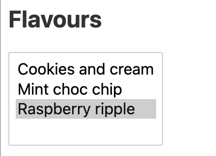

# 06. Bindings

## Inputs

일반적으로, Svelte의 데이터는 top-down으로 흐릅니다. 부모 컴포넌트가 자식 컴포넌트에 props를 전달하고, 컴포넌트는 엘리먼트에 속성을 부여하죠.

가끔 이 규칙을 깨는게 더 편할 때가 있습니다. 이 때, `bind:value` 디렉티브를 사용하면 좋습니다.

### 텍스트, TextArea

```html
<input bind:value={name}>
<textarea bind:value>
```

위 코드는 양방향으로 모두 동작합니다.
* input value가 변경 될 때, *name* 상태가 변경됨
* *name* 상태가 변경될 때, input value가 변경됨


변수명이 `value`라면 따로 기입할 필요 없이, `bind:value`로 충분합니다!


### 숫자

DOM에서는 모든게 string이라 숫자를 다룰 때 좀 귀차나여.. input에 `type="number"`나 `type="range"`등을 꼭 명시해주어야 하죠. Svelte에서는 bind로 해결 가능합니당!

```html
<input type=number bind:value={a} min=0 max=10>
<input type=range bind:value={b} min=0 max=10>
```

### 체크박스

체크박스에서는 토글로 checked 여부 true/false만 잘 bind해주세요.

`bind:checked={`_`truthy `_`or`_` falsy`_`}`

```html
<input type=checkbox bind:checked={isChecked}>
```

### 그룹

같은 value와 연관이 있는 여러개의 input들이 있다면, `bind:group`으로 묶어줄 수 있어요. 같은 그룹에 있는 라디오 버튼들은 상호 배제적이고, 같은 그룹의 체크박스들은 선택된 value들을 배열로 생성합니다.



```html
<script>
  let menu = [
    'Cookies and cream',
    'Mint choc chip',
    'Raspberry ripple'
  ];
  
  let scoops = 1;
  let flavours = menu[0];
</script>

<h2>Size</h2>

{#each [1, 2, 3] as num}
<label>
  <input type=radio bind:group={scoops} name="scoops" value={num}>
  {num} scoop{num > 1 ? 's': ''}
</label>
{/each}

<h2>Flavours</h2>

{#each menu as flavour}
<label>
  <input type=checkbox bind:group={flavours} name="flavours" value={flavour}>
  {flavour}
</label>
{/each}

<p># of scoops: {scoops}</p>
<p>Selected Flavours: {flavours.join(", ")}</p>
```






### 셀렉트

셀렉트에도 bind를 쓸 수 있어요.

```html
<select bind:value={selected}>
  {#each questions as question}
    <option value={question}>
      {question.text}
    </option>
  {/each}
</select>
```

`multiple` 옵션으로 여러개를 선택할 수 있는 셀렉트 박스를 띄울 수도 있죠.



```html
<select multiple bind:value={flavours}>
  {#each menu as flavour}
  <option value={flavour}>
    {flavour}
  </option>
  {/each}
</select>
```





다중 선택할 때는 ctrl(cmd)를 누르면 됩니다!




### Contenteditable 바인딩

input이 아닌 element여도 `contenteditable=true` 속성이 있다면, input을 받고 `textContent`나 `innerHTML`에 value를 바인딩할 수 있어요!

```html
<div contenteditable="true" bind:innerHTML={html}></div>
```

### Each 블록 바인딩

`each` 블록 안에서도 바인딩을 할 수 있어요.

```html
<script>
  let todos = [
    { done: false, text: 'finish Svelte tutorial' },
    { done: false, text: 'build an app' },
    { done: false, text: 'world domination' }
  ];
</script>

{#each todos as todo}
  <div class:done={todo.done}>
    <input
      type=checkbox
      bind:checked={todo.done}
    >

    <input
      placeholder="What needs to be done?"
      value={todo.text}
    >
  </div>
{/each}
```

이런식의 input에 바인딩해 변수를 조작하는 패턴은 *todos*의 immutablity를 유지하지 못합니다. Immutable한 상태를 유지하고 싶다면, 이벤트 핸들러를 사용해야 해요!

### 미디어

`<audio> `나 `<video>` 태그의 고유 property들도 바인딩하여 손쉽게 사용할 수 있습니다.

```html
<video src bind:currentTime={time} bind:paused></video>
```


보통 웹에서는 `timeupdate` 이벤트로 `currentTime`을 트래킹하지만, 그 이벤트는 너무 비정기적으로 발생하여 UI를 버벅거리게 할 수 있습니다. Svelte는 더 나은 방식인 `requestAnimationFrame`을 사용해 `currentTime`을 추적합니다!


`<audio> `와 `<video>` 태그에서 바인딩해 사용할 수 있는 속성들입니다.

|속성|read|write|
|--|--|--|
|`duration`|✅||
|`buffered`|✅||
|`seekable`|✅||
|`played`|✅||
|`seeking`|✅||
|`ended`|✅||
|`currentTime`|✅|✅|
|`playbackRate`|✅|✅|
|`paused`|✅|✅|
|`volume`|✅|✅|
|`muted`|✅|✅|

`<video>` 태그에서만 추가적으로 사용할 수 있는 속성입니다.

|속성|read|write|
|--|--|--|
|`videoWidth`|✅||
|`videoHeight`|✅||


### Dimensions

모든 블록레벨 element들은 `clientWidth`, `clientHeight`, `offsetWidth`, `offsetHeight`를 readonly로 바인딩할 수 있습니다.

```html
<div style="display:inline-block" bind:clientWidth={w} bind:clientHeight={h}></div>
```
### This

DOM에서 검색하지 않아도 바로 element를 바인딩 시킬 수 있습니다. 넘 꿀인것...

```html
<input bind:this={inputEl}>
<!-- 위 input은 컴포넌트 내 코드에서 inputEl이라는 이름으로 참조할 수 있음 -->
```

### 컴포넌트 바인딩

DOM에 바인딩해주듯, 컴포넌트에도 바인딩이 가능합니다. 이렇게 바인딩 된 요소는 부모와 자식 컴포넌트에서 양방향으로 업데이트 가능하죠!

```html
<Child bind:value={bidirectionalValue} />
```


이런 컴포넌트 바인딩은 아껴서 사용해야 합니다. 이런 바인딩은 앱 내 데이터 흐름을 헷갈리게 하고, '진실된 하나의 근원'이 흔들리게 하죠.


### 컴포넌트 인스턴스에 바인딩

DOM에 바인딩하듯이, 컴포넌트의 인스턴스에도 바인딩할 수 있습니다. 바인딩한 value로 해당 컴포넌트와 소통이 가능하죠!



```html
<script>
  import InputField from './InputField.svelte';

  let field;
</script>

<InputField bind:this={field}/>

<button on:click={() => field.focus()}>Focus field</button>
```


```html
<script>
  let input;

  export function focus() {
    input.focus();
  }
</script>

<input bind:this={input} />
```


위의 예제에서 *App*은 *field*라는 변수로 *InputField*의 인스턴스인 *focus()*에 접근해 실행시키는 것을 볼 수 있죠!