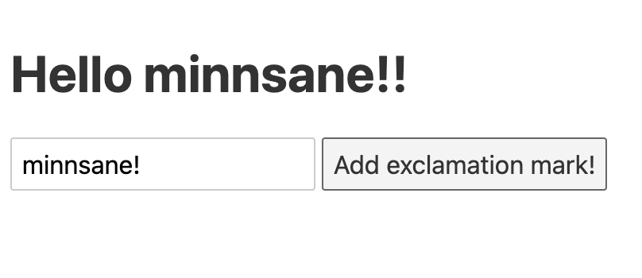

모든 컴포넌트의 상태가 앱 안의 컴포넌트 중첩구조와 관련있는 것은 아닙니다. 어떤 상태는 서로 관련 없는 불특정 컴포넌트들이나 다른 자바스크립트 모듈에 의해 참조되기도 하죠.

# Store와 구독

Svelte에서는 이를 위해 `store`를 씁니다. `store`는 값이 바뀔 때마다 다른 컴포넌트나 모듈에서 알아차릴 수 있게 하는 `subscribe` 메소드를 제공하는 객체입니다.

아래는 0으로 초기화 된 store *count*입니다.

```javascript
import { writable } from 'svelte/store';

export const count = writable(0);
```

외부에서는 아래와 같은 메소드를 사용할 수 있어요.

```javascript
import { count } from 'store.js';

// 스토어 구독
count.subscribe(value => {
  countValue = value;
});

// 스토어 업데이트
count.update(value => value + 1);

// 스토어 초기화
count.set(0);

```

## Store 구독 해제하기

`store`를 구독만하고 해제하지 않으면 메모리릭의 원인이 됩니다. `subscribe` 메소드는 `unsubscribe` 함수를 반환합니다.

```javascript
const unsubscribe = count.subscribe(value => {
  countValue = value;
});

// onDestroy 시점에 구독 해제하기
onDestroy(unsubscribe);
```

## Auto-subscription(자동구독)

이런 구독-해제 패턴은 보일러 플레이트를 많이 양산할 가능성이 있습니다. 이러한 수고로움을 줄여주기 위해, Svelte는 `$`만 앞에 붙이면 자동으로 구독해제가 되게 만들었어요!

```html
<script>
  import { count } from './store.js';
</script>

<h1>The count is {$count}</h1>
```


자동구독은 컴포넌트 최상단 scope에 선언(혹은 import)된 스토어 변수에만 동작합니다.


# Readable 스토어

모든 스토어 변수가 외부에서 `writable`하지는 않습니다. 어떤 변수는 읽기만 가능해야 하죠. 이를 위해 `readable` 스토어가 따로 있습니다. 

`readable(`_`initialValue,startFunction`_`)`

```javascript
import { readable } from 'svelte/store';

export const time = readable(new Date(), function start(set) {
	const interval = setInterval(() => {
		set(new Date());
	}, 1000);

	return function stop() {
    clearInterval(interval);
  };
});
```

위의 time 변수는 구독 시작 시점에 *new Date()*라는 값으로 초기화되어, *start*함수가 실행됩니다. 

*start*함수가 리턴하는 *stop*함수는 구독해제 시점에 실행됩니다.

# 파생된 스토어

기존 스토어의 값을 참조하는 다른 스토어를 만들 수 있습니다. 위의 예제에서 생성된 *time* 스토어를 참조하는 새로운 스토어 *elapsed*는 다음과 같습니다. 

```javascript
export const elapsed = derived(
	time,
	$time => Math.round(($time - start) / 1000)
);
```


여러개의 스토어에서 값을 받아 파생된 스토어를 만들 수 있고, 또다른 value를 return하는 대신, 명시적으로 기존 스토어 값을 `set`할 수도 있습니다. (비동기 파생에 유용!)

```javascript
export const startTime = derived(
  time,
  ($time, set) => {
    setTimeout(set($time), 1000);
  }
)
```

# 커스텀 스토어

`subscribe` 메소드만 제대로 구현되어 있다면, 그 객체는 스토어입니다. 그 외에는 아무것도 필요없어요. 원한다면, 아래와 같이 스토어를 커스터마이즈할 수 있죠.

```javascript
function createCount() {
	const { subscribe, set, update } = writable(0);

	return {
		subscribe,
		increment: () => update(n => n + 1),
		decrement: () => update(n => n - 1),
		reset: () => set(0)
	};
}
```

# 스토어 바인딩

`writable`한(`set` 메소드가 있는) 스토어라면, 컴포넌트 상태에 bind할 수 있습니다. 



```html
<script>
	import { name, greeting } from './stores.js';
</script>

<h1>{$greeting}</h1>
<input bind:value={$name}>

<!-- 아래 클릭 핸들러는 name.set($name+'!') 와 동일함! -->
<button on:click="{() => $name += '!'}">
	Add exclamation mark!
</button>
```


```javascript
import { writable, derived } from 'svelte/store';

export const name = writable('world');

export const greeting = derived(
	name,
	$name => `Hello ${$name}!`
);
```




